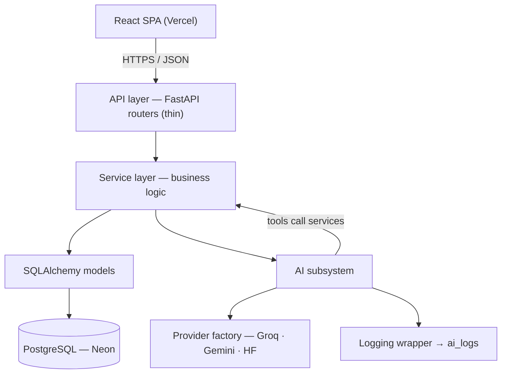
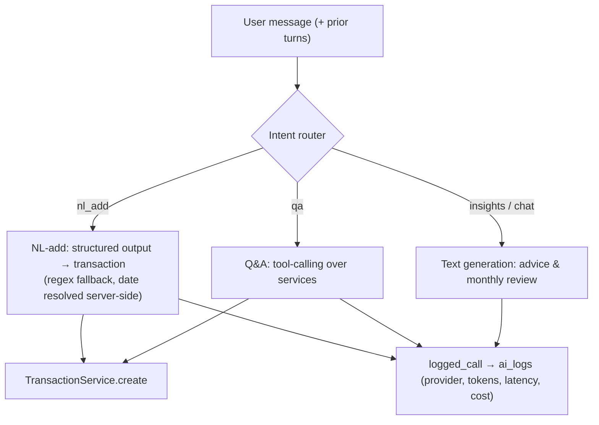
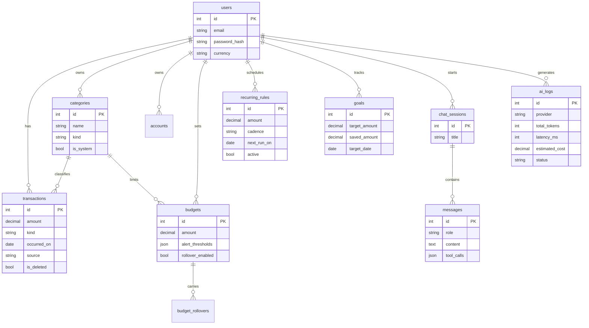

<div align="center">

# BudgetFlow

**A full-stack personal budget planner with an AI assistant.**
Track income and expenses, set category budgets with alerts, manage recurring transactions, and talk to an assistant that adds transactions from plain English, answers questions about your spending, and writes monthly insights.

[](https://github.com/karthikrasamsetti/budgetflow/actions/workflows/ci.yml)


**[Live app](https://budgetflow-nine-zeta.vercel.app)** · **[API docs](https://budgetflow-api-v2r3.onrender.com/docs)**

</div>

> **Note on the live demo:** the backend runs on a free tier that sleeps after inactivity, so the first request may take ~30–50s to wake. The app shows a "waking the server" banner while this happens.

---

## Contents

- [Highlights](#highlights)
- [Screenshots](#screenshots)
- [Architecture](#architecture)
- [The AI assistant](#the-ai-assistant)
- [Data model](#data-model)
- [Tech stack](#tech-stack)
- [Running locally](#running-locally)
- [Testing](#testing)
- [Deployment](#deployment)
- [Project structure](#project-structure)
- [Design decisions](#design-decisions)
- [Roadmap](#roadmap)

---

## Highlights

- **Clean layered architecture** — thin API routes, a service layer holding all business logic, and an AI subsystem whose tools call the *same* services the API does. One code path, tested once, reused everywhere.
- **Pluggable AI providers** — Groq, Gemini, and HuggingFace behind a factory, switchable from the UI or `.env`. Adding a provider is one class plus a registry entry.
- **AI observability** — every model call is logged (provider, tokens, latency, cost, status) to power a usage view. Chat history is persisted for multi-turn context.
- **Real product features** — auth (bcrypt + JWT access/refresh + rate limiting), category budgets with threshold alerts, recurring transactions with catch-up, savings goals, CSV import/export, budget rollover, and spending anomaly detection.
- **Production-grade tooling** — Alembic migrations, Docker + docker-compose, ruff, pytest (34 tests), pre-commit, and GitHub Actions CI.
- **Deployed** — React SPA on Vercel, FastAPI on Render, serverless Postgres on Neon.

---

## Screenshots

> _Replace these placeholders with real screenshots (drag images into the GitHub issue/editor, or commit them under `docs/`)._

| Overview | Ledger | Assistant |
|---|---|---|
| _dashboard.png_ | _ledger.png_ | _assistant.png_ |

---

## Architecture

Routes stay thin. All business logic lives in the service layer, which is the single place both the API and the AI tools call — so the assistant reuses the exact code paths the UI does.



**Key rule:** AI tools never touch the database directly. They call service methods, so query logic is written and tested once.

---

## The AI assistant

A user message is classified by a cheap keyword **intent router** into one of four jobs. This deliberately avoids a heavy agent framework — the assistant is three well-separated tasks behind a thin seam, not a stateful graph.



What it does:

- **Natural-language add** — *"spent 500 on transport today"* creates a categorized transaction. The provider returns structured JSON; if that fails, a deterministic regex parser takes over. The **date is resolved server-side** so a model can't mis-date an entry — relative cues like "today"/"yesterday" always win, and implausible model dates are overridden.
- **Spending Q&A** — *"how much did I spend on food this month?"* triggers tool-calling. Tools run real SQL aggregations through the service layer and the model answers from the returned numbers.
- **Auto-categorization** — resolves a free-text hint to one of your categories.
- **Monthly insights** — a short written overview.
- **Multi-turn memory** — sessions and messages are persisted, so follow-ups like *"what about last month?"* keep context.

---

## Data model



Money is stored as `Numeric(12,2)` — never float. Business rows use soft delete (`is_deleted`/`deleted_at`) and are filtered out of reads by default.

---

## Tech stack

| Layer | Choice |
|---|---|
| Backend | Python 3.12, FastAPI, SQLAlchemy 2.0 (async), Pydantic v2 |
| Database | PostgreSQL (Neon), Alembic migrations |
| Auth | bcrypt (passlib), JWT access + refresh (python-jose), slowapi rate limiting |
| AI | Groq / Gemini / HuggingFace via a provider factory; native function-calling |
| Frontend | React + Vite, React Router, Recharts, Axios |
| Tooling | uv, ruff, pytest, pre-commit, Docker + docker-compose |
| CI/CD | GitHub Actions; Vercel (frontend) + Render (backend) |

---

## Running locally

**Prerequisites:** Python 3.12, [uv](https://docs.astral.sh/uv/), Node 18+.

### Backend

```bash
cd backend
uv venv && source .venv/bin/activate      # Windows: .venv\Scripts\activate
uv pip install -e ".[dev]"
cp .env.example .env                       # SQLite defaults work with no external services
uvicorn budgetflow.main:app --reload       # http://localhost:8000  ·  /docs for Swagger
```

On SQLite the schema is created and system categories seeded automatically at startup. Set `GROQ_API_KEY` (or another provider) in `.env` to enable the assistant.

### Frontend

```bash
cd frontend
npm install
npm run dev                                # http://localhost:5173
```

The Vite dev server proxies API paths to the backend on `:8000`, so run the backend first.

### With Postgres (production parity)

```bash
docker compose up --build                  # from repo root: Postgres + API, migrations run on boot
```

---

## Testing

```bash
cd backend
pytest -q                 # 34 tests across auth, AI factory, core services, chat, and extras
ruff check .              # lint
ruff format --check .     # format
```

AI paths are tested against a mock provider, so the suite runs offline with no API keys. CI runs lint, format check, and tests on every push and PR.

---

## Deployment

Live setup: **Vercel** (frontend) + **Render** (backend) + **Neon** (Postgres).

### Backend on Render

1. Push the repo, then in Render: **New → Blueprint** and select it. `render.yaml` defines the web service.
2. Set environment variables on the service:
   - `DATABASE_URL` — your Neon connection string (the app converts it to the async driver form automatically).
   - `GROQ_API_KEY` — for the assistant.
   - `CORS_ORIGINS` — your Vercel URL as a JSON array, e.g. `["https://budgetflow-nine-zeta.vercel.app"]`.
   - `JWT_SECRET` is auto-generated by the blueprint.
3. On deploy, the container runs `alembic upgrade head` then starts Uvicorn. Health check: `/health`.

### Frontend on Vercel

1. Import the repo, set **Root Directory** to `frontend`.
2. Add env var `VITE_API_BASE` = your Render URL (e.g. `https://budgetflow-api-v2r3.onrender.com`).
3. Deploy. Then set `CORS_ORIGINS` on Render to the Vercel URL and redeploy the backend.

> Vite bakes env vars at **build time** — after changing `VITE_API_BASE`, redeploy without build cache.

---

## Project structure

```
budgetflow/
├── render.yaml                 # Render blueprint
├── docker-compose.yml          # local app + Postgres
├── .github/workflows/ci.yml    # lint + test
├── backend/
│   ├── Dockerfile
│   ├── pyproject.toml
│   ├── migrations/             # Alembic
│   └── src/budgetflow/
│       ├── main.py             # app factory
│       ├── config.py           # Pydantic settings
│       ├── db.py               # async engine / session
│       ├── models/             # SQLAlchemy models
│       ├── schemas/            # Pydantic request/response
│       ├── api/                # thin routers
│       ├── services/           # business logic
│       ├── ai/                 # factory, providers, router, tools, parsers, logging
│       └── security/           # hashing, jwt, rate limit
└── frontend/
    └── src/
        ├── api/                # axios client
        ├── pages/              # Login, Dashboard, Ledger, Budgets, Goals, Assistant
        ├── components/
        └── context/            # auth
```

---

## Design decisions

A few choices made deliberately, with the reasoning:

- **No LangGraph / agent framework.** The assistant is three separable jobs behind a keyword router — NL parsing, tool-calling over our own DB, and text generation. A stateful graph engine would add runtime weight without buying anything at this scale. `ai/router.py` is the seam where a graph would slot in if multi-step planning is ever needed.
- **No vector DB / embeddings.** The data is structured and numeric; SQL aggregations answer every spending question exactly and cheaply. Embeddings would be résumé-driven design, not a real need.
- **Service layer over fat routes.** Keeping logic in services is what lets the AI tools reuse the exact code the UI uses — the single most important structural decision in the codebase.
- **Server-side date resolution for AI entries.** Language models hallucinate dates; financial records can't. The server anchors "today"/"yesterday" itself and rejects implausible model dates.
- **Soft delete on financial rows.** Deleting money records outright is the wrong default.

---

## Roadmap

Deliberately deferred so v1 ships focused and fully working:

- **Predictive AI** — spend forecasting, budget recommendations, this-month-vs-last review, subscription detection.
- **OCR receipt scanner** — photo of a bill → extracted merchant/amount/date → prefilled transaction.
- **Voice entry** — spoken expenses on top of the existing NL-add path.
- **Notifications** as a first-class table (budget exceeded, goal reached, anomaly detected).
- **Extra reports** — net worth, savings rate, income trend.

---

<div align="center">

Built by [Karthik Rasamsetti](https://github.com/karthikrasamsetti) · MIT License

</div>